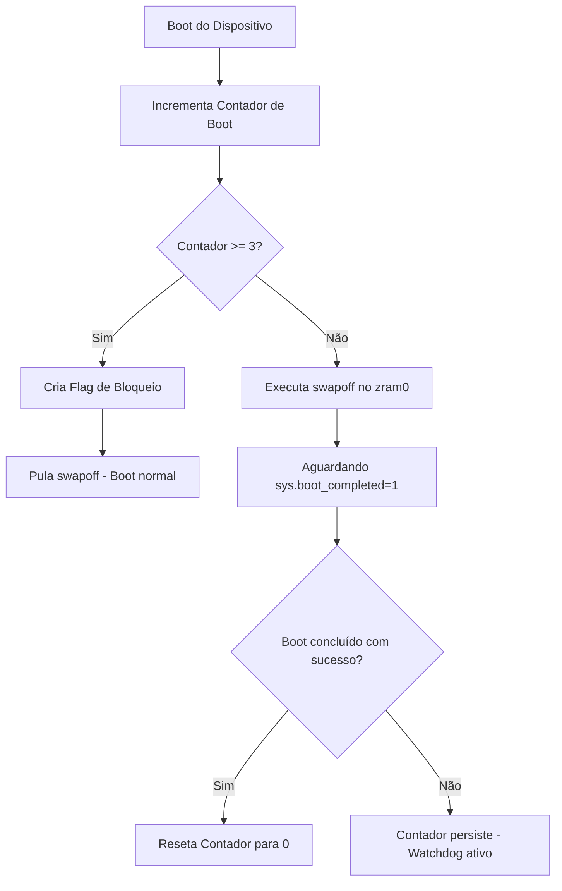

# Disable ZRAM on Boot (KernelSU / Magisk Module)

Módulo de baixa latência para **KernelSU e Magisk** projetado para desativar a ZRAM (`/dev/block/zram0`) durante o processo de inicialização do Android. Ideal para usuários de aparelhos de alta performance que desejam eliminar o overhead de compressão/descompressão na CPU, reduzindo lag e economizando bateria em cenários de multitasking severo.

---

## ⚡ Como Funciona?

O processo tradicional do Android preenche o swap da ZRAM logo após o boot. Este módulo intercepta a montagem de forma rápida e segura em duas etapas:

1. **post-fs-data.sh (Execução Precoce):** Roda o comando `swapoff` no zram0 antes mesmo que o Android comece a popular a memória comprimida.
2. **service.sh (Validação Tardia):** Aguarda até que a propriedade do sistema `sys.boot_completed` seja igual a `1` (carregamento completo da interface). Uma vez detectado, confirma o boot como estável.

---

## 🛡️ Mecanismo de Segurança (Anti-Bootloop)

Desativar o swap do sistema em estágios iniciais de boot pode, em raras ROMs customizadas ou kernels modificados, causar estouro de memória (Out-Of-Memory) e impedir a inicialização completa (bootloop). 

Para evitar isso de forma 100% autônoma, o módulo implementa um **Watchdog Inteligente**:



Se o dispositivo falhar em dar boot completo por 3 vezes consecutivas, o módulo **desliga a si mesmo de forma automática** nos próximos boots para restaurar o acesso padrão à ZRAM e permitir a recuperação segura do sistema.

---

## 📂 Estrutura do Módulo

* `module.prop`: Metadados de identificação do módulo.
* `post-fs-data.sh`: Script executado em modo root precoce para desativar o swap.
* `service.sh`: Script de confirmação de boot e reset do watchdog.
* `index.html`: Dashboard interativo com simulador de boot animado da Google.

---

## 🛠️ Instalação

1. Compacte os arquivos do diretório em um arquivo `.zip`:
   ```bash
   zip -r disable-zram-boot.zip . -x "*.git*" "index.html" "server.py"
   ```
2. Instale o arquivo gerado via aplicativo do **KernelSU**, **Apatch** ou **Magisk**.
3. Reinicie o dispositivo.

---

## 📊 Visualização de Inicialização
Inicie a landing page interativa na porta `8086` executando `python server.py` para visualizar o dashboard de status e acompanhar a simulação animada do fluxo de logs do Android.
